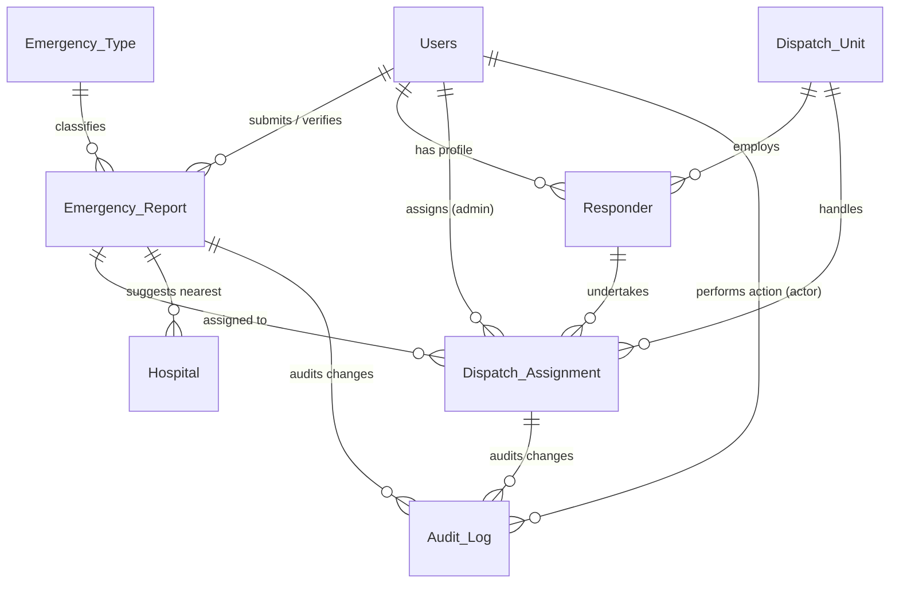

# 🚨 Emergency 999 Response DBMS

[](https://www.php.net/)
[](https://www.mysql.com/)
[](https://tailwindcss.com/)
[](https://leafletjs.com/)

A real-time emergency dispatch and response Database Management System (DBMS) prototype designed for Bangladesh. Integrates PHP, MySQL (InnoDB), and Leaflet/OpenStreetMap to manage incident reporting, automated geo-routing, resource capacity limits, and responder lifecycle.

---

## 🌟 Key Features

*   **🚨 Live Incident Map** — Public portal showing active incidents in real time with color-coded priority rings (Leaflet.js + OpenStreetMap).
*   **📍 Geo-Location Picker** — Citizens can place a map pin on the homepage to register exact coordinates.
*   **🤖 Automated Dispatch** — On report verification, the system uses the **Haversine formula** to locate the nearest available dispatch unit and responder within `DISPATCH_RANGE_KM` (default: 12 km).
*   **🔒 InnoDB Pessimistic Locking** — Employs `SELECT FOR UPDATE` to prevent race conditions during concurrent responder dispatches.
*   **🚒 Full Staffing Seeding** — Fully staffed with **6 responders per unit** across all 15 units (90 responders total), guaranteeing robust coverage and zero staffing alerts.
*   **📊 Capacity-Aware Resource Management** — Automatically manages unit statuses (sets to `busy` when active load meets capacity, and reverts to `available` once resolved). 
*   **⚙️ Real-time DB Triggers** — Enforces logic constraints directly in the database layer via **5 MySQL triggers** (updates load, logs audit trails, and corrects unit status on capacity modification).

---

## 🏗️ System Architecture

### Database Entities (8 Tables)



*   **`Users`**: System accounts (Admin, Responder, Citizen) with bcrypt credentials.
*   **`Emergency_Type`**: Classifications (Fire, Medical, Police, Rescue) with priority levels, custom map icons, and colors.
*   **`Emergency_Report`**: GPS-pinned incidents with severity levels, status lifecycle, and requested services.
*   **`Dispatch_Unit`**: Stations (Fire, Police, Ambulance, Rescue) with geographic base coordinates, status, and maximum assignment capacities.
*   **`Responder`**: Individual profiles tied to specific dispatch units.
*   **`Dispatch_Assignment`**: Links incidents to units and responders with a detailed action timestamp trail.
*   **`Hospital`**: Nearby medical centers tracked for bed availability and proximity suggestions.
*   **`Audit_Log`**: Immutable logging of all state transitions and user/system changes.

### Database Triggers (MySQL)

| Trigger | Timing / Table | Event | Action |
|---|---|---|---|
| `after_dispatch_assignment_insert` | `AFTER INSERT ON Dispatch_Assignment` | `INSERT` | Increments `active_assignments_count` on the unit; flips unit status to `busy` if capacity is reached; marks responder as `assigned`. |
| `after_dispatch_assignment_update` | `AFTER UPDATE ON Dispatch_Assignment` | `UPDATE` | On completion/cancellation: decrements count, updates unit status, and frees responder. On arrival: marks responder `on_scene`. |
| `after_dispatch_assignment_delete` | `AFTER DELETE ON Dispatch_Assignment` | `DELETE` | Restores unit load count and responder availability if an active assignment is deleted. |
| `after_emergency_report_update` | `AFTER UPDATE ON Emergency_Report` | `UPDATE` | Logs report status modifications to the `Audit_Log` table. |
| `before_dispatch_unit_update` | `BEFORE UPDATE ON Dispatch_Unit` | `UPDATE` | **Capacity Sync**: Recalculates unit status automatically if `capacity` or `active_assignments_count` is updated. |

---

## 🚀 Installation & Setup

### Prerequisites

*   PHP 8.1+
*   MySQL 8.0+ or MariaDB 10.4+
*   Web server (XAMPP, Laragon, Apache, or similar local environment)

### Steps

1.  **Clone or place the directory** inside your web root (e.g., `C:/xampp/htdocs/emergency-999`).
2.  **Start your PHP & MySQL services** (via XAMPP Control Panel).
3.  **Run the automated database installation** script using PHP CLI:
    ```bash
    php database/reset_db.php
    ```
    *(If php is not in your environment PATH, run with full path: `d:\Xampp\php\php.exe database/reset_db.php`)*
4.  If your MySQL credentials are not `root` with an empty password, configure them in `config/config.php`.
5.  Access the web application at: [http://localhost/emergency-999/](http://localhost/emergency-999/)

---

## 👥 Demo User Accounts

All seeded credentials use the password: `password`

| Role | Email | Base Unit / Access |
|---|---|---|
| **Admin** | `admin@999.local` | Full control room access |
| **Citizen** | `user@999.local` | Report submissions and personal history tracking |
| **Tejgaon Fire Lead** | `responder@999.local` | Tejgaon Fire Station (Unit 1) |
| **Dhaka Ambulance Officer** | `kamal@999.local` | Dhaka Metro Ambulance (Unit 2) |
| **Gulshan Police Officer** | `rafiq@999.local` | Gulshan Police Station (Unit 3) |

---

## 📁 Codebase Reference

*   [index.php](file:///d:/Xampp/htdocs/emergency-999/index.php) — Public landing page, leaflet reporting interface, and live incident dashboard.
*   [config/config.php](file:///d:/Xampp/htdocs/emergency-999/config/config.php) — System-wide credentials and configurations (dispatch range, base URL).
*   [includes/](file:///d:/Xampp/htdocs/emergency-999/includes/) — Core PHP modules containing layout renders, database connections, and helper scripts:
    *   [dispatch_helpers.php](file:///d:/Xampp/htdocs/emergency-999/includes/dispatch_helpers.php) — Proximity calculations (Haversine) and auto-dispatch logic.
    *   [auth.php](file:///d:/Xampp/htdocs/emergency-999/includes/auth.php) — Role-based authorization layers and CSRF protection.
*   [admin/](file:///d:/Xampp/htdocs/emergency-999/admin/) — Admin console files:
    *   [reports.php](file:///d:/Xampp/htdocs/emergency-999/admin/reports.php) — Central dispatcher console. Verifies incidents and assigns responder suggestions.
    *   [manage.php](file:///d:/Xampp/htdocs/emergency-999/admin/manage.php) — Resource management CRUD tables (Units, Hospitals, Responders).
*   [responder/index.php](file:///d:/Xampp/htdocs/emergency-999/responder/index.php) — Portal for field responders to view range limits, self-assign, and transition task statuses.


For a comprehensive breakdown of every file, module, database feature, and API endpoint, see the **[📖 Codebase Guide](CODEBASE_GUIDE.md)**.